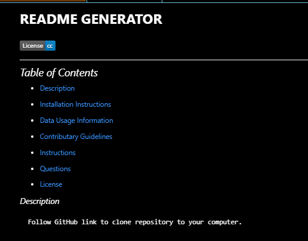

# **README GENERATOR**

---

## *Description*

 This application generates a professional README markdown file.  Upon launch, a command-line accepts user input.  User is prompted for information about their project:  Description, Table of Contents, Usage, License, Contribution Guidelines, any tests, and contact links for any questions.  Data entered is then integrated into the finished markdown file, complete with a table of contents and links navigating to corresponding sections.

## *Installation Instructions*

Must install Inquirer Package prior to use :  [Inquirer 8.2.4 download](https://www.npmjs.com/package/inquirer/v/8.2.4) 

  [GitHub Repository](https://github.com/JosieSavill/readmeGenerator)

  [Deployed README GENERATOR](https://josiesavill.github.io/readmeGenerator/)

## *Instructions*

1. Open integrated terminal  
2. RUN "node index.js"
3. Follow prompts and enter appropriate data related to your project
4. Choose appropriate license
5. When "I am finished writing" appears you are done and README.md will be completed

🎥 [DEMO video](https://drive.google.com/file/d/1SARbTF5wDJZ7U1aB6KR7RWukjtfRUfh-/view)

---

    
